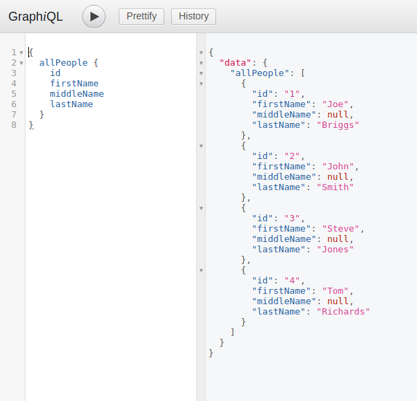
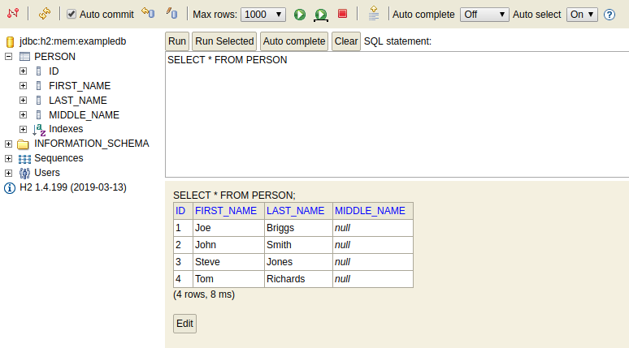

[](https://travis-ci.org/SuperEvenSteven/java-documentation-template) [](https://opensource.org/licenses/mit-license.php)

# spring-boot-graphql-example

This is a simple maven-based Java example that uses spring-boot, an H2 embedded in-memory database and Hibernate ORM to stand up a graphql service. This example is a self-contained and ready to play with after running ```mvn spring-boot:run```

The example defines a basic JPA annontated data model containing a single entity, Person. When spring-boot runs it takes that entity definition and creates an in-memory H2 embedded database with pre-poluated dummy data. The GraphQL service is then started and the H2 data is offered as a queryable repository via GraphQL services as a GraphQL API found at http://localhost:8080/.

## Compiling and Running
This project was compiled and tested using JDK8 and Maven 3.6.1.

### Starting the Service
Run the following to compile and run the example GraphQL service.

```bash
mvn spring-boot:run
```

The service is ready for use when you see a similar log line as below:
```bash
2019-07-16 12:15:11.053  INFO 67805 --- [  restartedMain] c.o.s.graphql.GraphQLSpringBootApp       : Started GraphQLSpringBootApp in 6.457 seconds (JVM running for 6.931)
```
### Stopping the Service
Use CTRL+C to stop.

## Exploring the GraphQL Service
In addition to a GraphQL service and API, this project starts up two graphical interfaces, GraphiQL and H2-Console to play around with.

### GraphiQL 
A web console that can be used to explore the schema and test querying the GraphQL API.
Found at: http://localhost:8080

The left-hand pane is used to input your client-side GraphQL queries. The right-hand pane displays the result returned back from this GraphQL service.



### H2-Console 

A web console to manage the H2 in-memory database. Found at: http://localhost:8080/h2-console (login credentials are found in [application.properites](src/main/resources/application.properties))



## Project Structure
There aren't many files to this project which is quite impressive considering this example starts up a GraphQL service and serves dummy data from an H2 embedded database.

The classes defined in this example are quite small and succinct. They essentially define how the GraphQL runtime serves the H2 data for query requests.

* **GraphQLSpringBootApp.java** - entry point of the GraphQL service, also defines where the entity model is located 
* **Person.java** - entity model
* **PersonRepository.java** - defines the CRUD operations against the Person table in the H2 embedded database 
* **PersonQuery.java** - defines how the 'allPeople' query returns data back by using the PersonRepository 

The following 3 files are used for configuration, schema definition and dummy data population:

* src/main/resource/**application.properties** - defines the hibernate connection to the H2 embedded database
* src/main/resource/**data.sql** - dummy data to go in the H2 database on startup
* src/main/resource/**schema.graphqls** - GraphQL schema

Other files:

* **pom.xml** - defines the dependencies needed to build the project
* src/main/webapp/**index.html** - the GraphiQL web interface
 

## GraphQL Schema
The schema in this example defines a query object called Person that a consumer is interested. It also has a query that returns all Person objects called 'allPeople'. 

**Note:** It's important that the member variables of the Person entity match the Person fields in the GraphQL schema.

```
schema {
    query: Query
}

type Query {
    allPeople: [Person]
}

type Person {
    id: ID!
    firstName: String!
    middleName: String
    lastName: String!
}
```

## Simplifying Repository Definitions
To reduce boiler-plate CRUD code, this example takes advantage of the spring framework's CrudRepository class. 

Defining the PersonRepository code is no more than a four lines of code:

```java
package com.ohair.stephen.graphql.repositories;

import org.springframework.data.repository.CrudRepository;
import com.ohair.stephen.graphql.model.Person;

public interface PersonRepository extends CrudRepository<Person, Long> {
}

```

## Connecting to Other Databases
There are plenty of examples connecting to MySQL databases but not many for Oracle PL/SQL. 

So here is an example of what to add to this project to connect to an Oracle 12 database: 

***pom.xml***

Remove the H2 dependency and add:

```
<dependency> <!-- Oracle JDBC driver -->
    <groupId>com.oracle</groupId>
    <artifactId>ojdbc7</artifactId>
    <version>12.1.0.1</version>
</dependency>
```

***application.properties***
This configuration can be used to connect to an Oracle12 datbase using hibernate.

```
spring.datasource.url=jdbc:oracle:thin:@<DATABASE_URL>:<PORT>/<SID>
spring.datasource.username=
spring.datasource.password=
spring.datasource.driver.class=oracle.jdbc.driver.OracleDriver
spring.jpa.database-platform=org.hibernate.dialect.Oracle10gDialect
spring.jpa.hibernate.ddl-auto=none
spring.jpa.show-sql=true
```

**Note:** be very careful not to blat an existing db schema by ensuring ```spring.jpa.hibernate.ddl-auto=none``` is included as above.

## License
For all files in this repository that don't contain explicit licensing, the MIT license then applies. See the accompanying LICENSE for more details.

